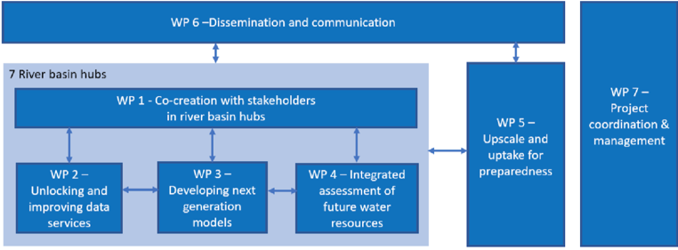
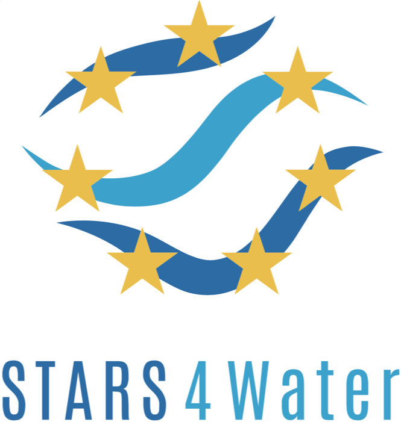

# Stars4Water

## About

The collaborative project funded under the Horizon Europe Framework Programme that aims to improve the understanding of climate change impacts on water resources availability and the vulnerabilities for ecosystems, society and the economy at river basin scale

**Official Website**: [https://stars4water.eu/](https://stars4water.eu/)

### Workplan 

The overall implementation of the project is structured in 7 Work Packages (WP). Central in the project are the 7 River Basin Hubs, which will serve as living labs for co-creation and validation of new services, models and tools that support climate resilient water resources planning. 

  

### Github repository 

This repository contains the codes developed within the activities of WP3, WP4, and WP5, for the definition of new tools and models that enable better decision-making by stakeholders in different hydrological basins within and outside Europe.

## Models

### 1. Water Table Depth (WTD) — Seine River Basin (WP3, Task 3.4)

Two machine-learning approaches are applied **point-by-point** to predict the **monthly water table depth (WTD)** across the Seine river basin.

- **What it does:** Given the recent history of the groundwater level and various predictors, the model forecasts the next month's WTD for each location of the basin.
- **Inputs:** monthly GRACE terrestrial-water-storage, precipitation, maximum temperature and evapotranspiration time series per point. Several **predictor combinations** (from 1 to 4 predictors) and **lag windows (4, 6 or 8 months)** are tested.
- **Models:** a **Random Forest Regressor** and a single-layer **LSTM**. For every point, the best combination of predictors + lag (maximizing **KGE** on the test period) is selected.
- **Target:** monthly **water table depth anomaly**.
- **Output / evaluation:** per-point metrics (**KGE, correlation r, PBIAS, RMSE**) for training and test, plus basin maps of the best configuration and the test-period performance.

### 2. Reservoir Storage Forecasting — UK, Spain, France (WP3, Task 3.4)

An Extra-Trees regression model to predict the **monthly reservoir storage** across reservoirs in the UK, Spain (Duero) and France (Seine).

- **What it does:** Given the recent history of the reservoir storage, plus forecast rainfall and temperature over the upstream catchment, the model forecasts the next month's storage for each reservoir.

Example data and usage are detailed in a walk-through notebook: 2.3_Next_ETreservoirs.ipynb

An example of how to train a similar model in another region can be found in 2.4_Final_ETreservoirs.ipynb

DOI: 10.5281/zenodo.22899268

#### Binder

Launch the reservoir storage forecasting notebook directly in your browser — no installation required:

### Funding

This project has received funding from the European Union’s HORIZON Research and Innovation Actions Programme under Grant Agreement No. 101059372

  
  

